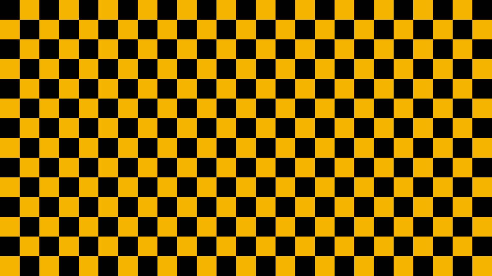
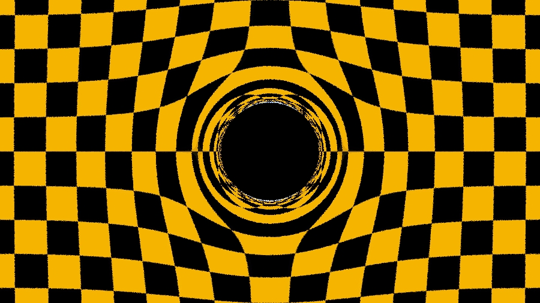

# Ray tracing Black Holes

This project is a parallel open-source implementation of a *ray-tracer* in the presence of a *black hole geometry*.
The implementation uses a few different techniques usually present in parallel scientific computing,
such as, mathematical approximations, utilization of scientific libraries, shared-memory and distributed-memory parallelism.


## Installation
### Requirements
* Need a recent boost version. Version 1.86.0 was chosen for the project. Later (and some earlier) versions are likely to work, but require you to change CMakeLists.txt. We tried compiling with some 1.7* versions, but were not able to compile GIL. Only boost headers are required, specifically GIL.
* `source teachsetup` on the scinet TEACH cluster
* `source niagarasetup` on the scinet TEACH cluster
* See these scripts for the versions of libraries required and tested on.

### Building
A Makefile is provided to build across multiple different build styles. Support exists for MPI, OpenMP, or a hybrid of the two. Support additionally exists for Release builds, and Debug builds.

* `source teachsetup`  (this would guarantee that the necessary requirements are present in the system)
* `cmake -DENABLE_OPENMP=True -DENABLE_MPI=True -DCMAKE_BUILD_TYPE=Release`


### Custom Builds
When `make` is run in the top level directory, 3 targets are built:

  - `debug`, the default build
  - `openmp`, an openmp only build (equivalent to do `cmake -DCMAKE_BUILD_TYPE=Release -DENABLE_MPI=False -DENABLE_OPENMP=True`)
  - `release`, openmp+mpi (equivalent to do `cmake -DCMAKE_BUILD_TYPE=Release -DENABLE_MPI=True -DENABLE_OPENMP=True`)


A manual build (without the top level makefile) is also possible by doing:

```
mkdir mpi && cd mpi
cmake -DCMAKE_BUILD_TYPE=Release -DENABLE_MPI=True -DENABLE_OPENMP=False ..
... lots of cmake output ...

make

... lots of make output...

./main # Note: You do NOT! need to supply any arguments, the program is coded with a default scene for easy demoing
> img.jpg is output

mpirun -np 4 ./main
```


### Profiling

You can optionally enable MPI in addition to this command.

`cmake -DENABLE_OPENMP=True -DENABLE_PROF=True -DCMAKE_BUILD_TYPE=Release`


## Running

You can run `./main -h` for an updated list of help options after building.

```
  -i <img_name>:
    default ../squares.jpg
  -b <black hole loc>
    default -400
  -B <background loc>
    default -500
  -M <mass>
    default 10
  -e <epsilon>
    default 5
  -W <width>
    default 400
  -d
    set debug, default false
  -c <cores>
    use <cores> for multiprocessing.
  -S
    wait for GDB to attach before initializing mpi..
  -s <number of samples>
    default 1
```

After building with MPI, you can run the binary using `mpirun -np NP ./main <options>`, where `NP` reoresents the *number of processes* to use.
When supplying `-np` to `mpirun`, this controls the number of MPI worker processes. When supplying `-c` to `./main`, this controls the number of *OMP threads*.
These options work concurrently when built with OpenMP and MPI support.
For instance, the following command will run the code in 2 processes and 40 threats each:
```
mpirun -np 2 ./main -c 40 -i image.jpg
```

Thr original image and resulting one from executing the previous command, for reference are shown bellow:




### Examples

As for how to create the actual images themselves, they were done with pretty high settings:

```
make
... a lot of build output...

cd release
~/BHRaytracer/release/main -i ~/STScI-H-CANDELS_UDF-16300x9000.jpg -B -1000 -s 10 -W 2700
>output is img.jpg

./main -i ../eagle.jpg -s 10 -W 2700
>output is img.jpg
```


## Documentation

Documentation can be generated using `doxygen`
